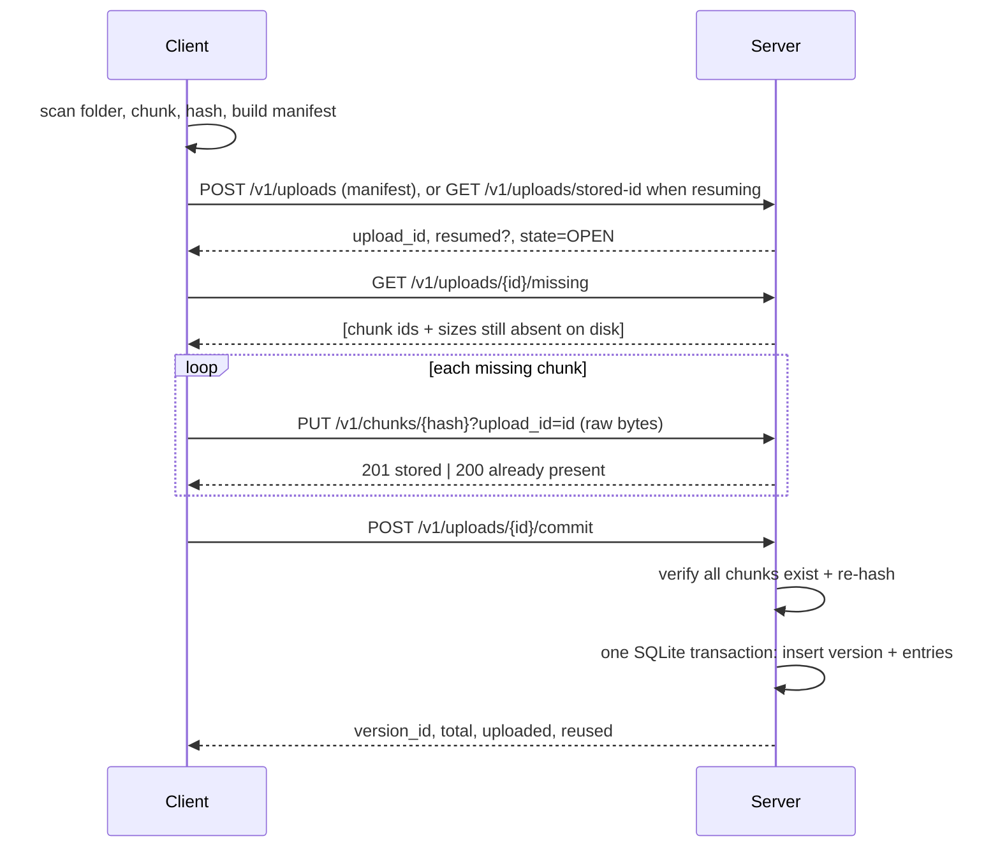

# BrokenVault — Low-Level Design

| | |
|---|---|
| **Companion to** | `PRD.md` (requirement IDs FR-x / AC-x / NFR-x are referenced below) |
| **Version** | 1.0 |
| **Date** | 2026-09-30 |
| **Reference stack** | Python 3.11+, stdlib `http.server` + `sqlite3`, stdlib `http.client` on the client, `pytest` for tests (no third-party runtime dependencies). The design is language-neutral; only the module names would change. |

---

## 1. Design decisions at a glance

| # | Decision | Reason |
|---|---|---|
| D1 | Fixed-size chunks, 256 KiB default, configurable per backup and recorded in the manifest | Simple, repeatable, in the suggested range; CDC left as a stretch hook |
| D2 | Chunk ID = SHA-256 hex of original bytes; server recomputes before accepting | Brief requirement; makes the server the authority |
| D3 | Chunk files on disk in a content-addressed layout; **file existence on disk is the source of truth for "server has chunk"** | Damage (deleted/altered chunk) is then always visible to verify and to later backups |
| D4 | SQLite (WAL, `synchronous=FULL`) for metadata: uploads, versions, entries, chunk references | Atomic multi-row commit; survives restart |
| D5 | Uploads and versions are separate tables. A version row is written **only** inside the commit transaction | Unfinished data is structurally invisible to `list` and `restore` |
| D6 | Resume is by upload ID: the server persists it in the DB, the client persists it in a local state file and prints it; `POST /uploads` is also idempotent for an identical manifest (returns the existing open upload) | Matches the brief ("return to the same unfinished upload"); idempotency covers a crash between the server's reply and the client's save |
| D7 | Chunk write path: temp file → hash check → fsync → atomic rename → fsync directory | No partially written chunk is ever visible |
| D8 | Commit re-reads and re-hashes every distinct referenced chunk, then inserts version rows in one transaction | Satisfies "pass a hash check" even for chunks reused from older versions |
| D9 | Accounting is derived from a per-upload `upload_chunks` record written before the rename | Correct, non-double-counted bytes across crashes and resumes |
| D10 | HTTP/1.1 with JSON control messages and raw-byte chunk bodies | Simple, debuggable with `curl`, no extra dependencies |

## 2. Architecture

```
┌────────────────────────────── Client (bv) ──────────────────────────────┐
│ CLI ─ Scanner ─ Chunker ─ ManifestBuilder ─ BackupRunner ─ Restorer     │
│                                          │             │                │
│                                     Transport (HTTP, retries)           │
└──────────────────────────────────────────┼─────────────────────────────┘
                                           │  HTTP  (loopback or LAN)
┌──────────────────────────────────────────┼─────── Server (bv-server) ───┐
│ HTTP Router ─ Handlers                   │                              │
│        │                                                                │
│   UploadService   VersionService   VerifyService                        │
│        │                 │               │                              │
│     ┌──┴──────────┐   ┌──┴───────────────┴──┐                           │
│     │ ChunkStore  │   │ MetadataDB (SQLite) │                           │
│     │ (files)     │   │ uploads / versions /│                           │
│     │ chunks/ tmp/│   │ entries / chunk refs│                           │
│     └─────────────┘   └─────────────────────┘                           │
└─────────────────────────────────────────────────────────────────────────┘
```

Backup flow (PRD scan → plan → transfer → commit):



## 3. Repository layout

```
brokenvault/
├─ README.md
├─ docs/architecture.md
├─ requirements.txt / requirements-dev.txt (+ lock file)
├─ pyproject.toml
├─ src/brokenvault/
│  ├─ common/
│  │  ├─ constants.py      # CHUNK_SIZE default, limits, API prefix
│  │  ├─ hashing.py        # sha256 helpers (stream + bytes)
│  │  ├─ paths.py          # validate_rel_path, to_posix, safe_join
│  │  ├─ manifest.py       # dataclasses, validate, canonicalize, manifest_id
│  │  └─ errors.py         # error codes -> exceptions -> HTTP/exit codes
│  ├─ server/
│  │  ├─ __main__.py       # bv-server entrypoint
│  │  ├─ http_app.py       # router + handlers (thin)
│  │  ├─ chunk_store.py    # path layout, atomic put, open/read, exists
│  │  ├─ db.py             # connection, schema, migrations, tx helper
│  │  ├─ upload_service.py # create, missing, put_chunk, commit, status
│  │  ├─ version_service.py# list, get manifest
│  │  ├─ verify_service.py # damage scan + impact
│  │  └─ faults.py         # test-only fault injection
│  └─ client/
│     ├─ __main__.py / cli.py   # argparse: backup, list, restore, verify
│     ├─ scanner.py             # walk, stat, classify
│     ├─ chunker.py             # fixed-size streaming chunker
│     ├─ transport.py           # HTTP calls, retry/backoff, error mapping
│     ├─ backup.py              # BackupRunner
│     ├─ restore.py             # Restorer
│     └─ output.py              # human + JSON formatting
└─ tests/
   ├─ unit/        # paths, manifest, chunker, chunk_store
   ├─ integration/ # live server subprocess, full scenarios
   └─ helpers/     # tree builder, tree compare, chunk tamper
```

## 4. Shared components

### 4.1 Constants
```
API_PREFIX        = "/v1"
DEFAULT_CHUNK_SIZE= 256 * 1024
MAX_CHUNK_SIZE    = 4 * 1024 * 1024     # server rejects larger bodies
MAX_MANIFEST_BYTES= 64 * 1024 * 1024
HASH_RE           = ^[0-9a-f]{64}$
```

### 4.2 Path validation (`paths.py`) — FR-1.5, NFR-6
`validate_rel_path(p) -> str` raises `INVALID_PATH` if any rule fails:

1. Non-empty, valid UTF-8, no NUL, no `\`.
2. Does not start with `/`; does not match a drive prefix (`^[A-Za-z]:`).
3. Split on `/`: no empty segment, no `.`, no `..`.
4. Each segment length ≤ 255 bytes.

Manifest-level checks (in `manifest.validate`):
- Paths are unique (exact match). Names that differ only by letter case are not checked (the brief's tests avoid them).
- Every parent path of an entry must itself be a `dir` entry, and a `file` path must not be the parent of another entry. The client emits an entry for **every** directory, including non-empty ones, so restore can set directory mtimes.

`safe_join(root, rel)` (restore): `resolved = realpath(join(root, rel))`; must start with `realpath(root) + os.sep`, else `UNSAFE_PATH`.

### 4.3 Manifest schema (`manifest.py`)
```json
{
  "format": 1,
  "root_name": "event-project",
  "chunker": { "algo": "fixed", "size": 524288 },
  "entries": [
    { "path": "art",               "type": "dir",  "mtime_ns": 1767000000000000000 },
    { "path": "art/poster.png",    "type": "file", "size": 4194304, "mtime_ns": 1767000000000000000,
      "chunks": [ { "id": "3fa9…", "size": 524288 }, … ] },
    { "path": "exports",           "type": "dir",  "mtime_ns": 1767000000000000000 },
    { "path": "empty.txt",         "type": "file", "size": 0, "mtime_ns": 1767000000000000000, "chunks": [] }
  ]
}
```

Validation rules (server re-validates everything received):
- `format == 1`; `chunker.algo == "fixed"`; `0 < chunker.size ≤ MAX_CHUNK_SIZE`.
- Entries sorted by `path` (client sorts; server accepts any order but canonicalizes).
- `type ∈ {file, dir}`; files: `size ≥ 0`, `chunks` present; dirs: no size/chunks.
- For files: `sum(chunk.size) == size`; every chunk `1 ≤ size ≤ chunker.size`; with fixed chunking every chunk except the last equals `chunker.size`; `size == 0 ⇒ chunks == []`.
- Every `chunk.id` matches `HASH_RE`.
- The same `chunk.id` carries the same `size` everywhere in the manifest.
- `mtime_ns` is a non-negative integer.

Canonical form and manifest ID (D6):
```
canonical = json.dumps(manifest_with_entries_sorted_by_utf8_path,
                       sort_keys=True, separators=(",", ":"), ensure_ascii=False)
manifest_id = sha256(canonical.encode("utf-8")).hexdigest()
```
Derived values (computed by the server, never trusted from the client):
- `total_bytes = Σ file.size`
- `file_count`, `dir_count`
- `unique_chunks = ordered distinct (id, size)` across all files

### 4.4 Chunker (client `chunker.py`)
Streaming, constant memory:
```python
def iter_chunks(path, size):
    with open(path, "rb") as f:
        offset = 0
        while True:
            buf = f.read(size)
            if not buf: break
            yield offset, len(buf), sha256(buf).hexdigest()
            offset += len(buf)
```
The scanner keeps a location map `first_location[chunk_id] = (path, offset, length)` so a chunk to upload can be re-read from disk later instead of held in memory. Before sending, the client re-reads the range and re-hashes it; a mismatch aborts with `SOURCE_CHANGED` (guards the "files do not change" assumption at low cost).

## 5. Server design

### 5.1 Configuration
`bv-server --data-dir ./vault --host 127.0.0.1 --port 8765`

Environment variables (test hooks are listed in section 9.4).

### 5.2 On-disk layout
```
<data-dir>/
├─ meta.db                 # SQLite (+ -wal, -shm)
├─ chunks/
│  └─ ab/                  # first two hex chars
│     └─ ab12…ef           # file name = full 64-char hash, content = raw chunk bytes
└─ tmp/
   └─ <uuid>.part          # in-flight chunk writes
```
Chunk files contain the raw bytes only (no header), so tampering in the demo is a one-byte edit. `tmp/` lives on the same filesystem as `chunks/` so the rename is atomic.

### 5.3 ChunkStore API
```python
class ChunkStore:
    def path(self, h) -> Path
    def exists(self, h) -> bool                      # os.path.isfile
    def size(self, h) -> int | None
    def put(self, h, stream, length, max_len) -> PutResult   # STORED | ALREADY_PRESENT
    def open(self, h) -> BinaryIO
    def iter_all_hashes(self) -> Iterator[str]       # for optional orphan scan
    def cleanup_tmp(self)                            # at startup
```

`put` algorithm (D7):
```
if exists(h): drain and discard body; return ALREADY_PRESENT
tmp = tmp/<uuid>.part
hasher = sha256(); n = 0
with open(tmp, "wb") as f:
    while n < length:
        block = stream.read(min(64 KiB, length - n))
        if not block: raise CLIENT_ABORTED (delete tmp)
        f.write(block); hasher.update(block); n += len(block)
    if hasher.hexdigest() != h: delete tmp; raise CHUNK_HASH_MISMATCH
    f.flush(); os.fsync(f.fileno())
# caller records upload_chunks intent here (see 5.5), then:
os.makedirs(chunks/h[:2], exist_ok=True)
os.replace(tmp, path(h))          # atomic; if a concurrent put won, content is identical
fsync(chunks/h[:2] directory)     # POSIX; skipped on Windows
return STORED
```
`put` is split internally into `stage()` (write + verify tmp) and `publish()` (rename) so the service can insert the accounting row between them.

A per-hash lock (striped lock table, 256 locks keyed by `int(h[:2],16)`) serializes publish of the same hash.

### 5.4 SQLite schema (`db.py`)
```sql
PRAGMA journal_mode = WAL;
PRAGMA synchronous  = FULL;
PRAGMA foreign_keys = ON;

CREATE TABLE uploads (
  upload_id      TEXT PRIMARY KEY,          -- uuid4 hex
  manifest_id    TEXT NOT NULL,             -- sha256 of canonical manifest
  manifest_json  TEXT NOT NULL,             -- canonical JSON
  state          TEXT NOT NULL CHECK (state IN ('OPEN','COMMITTED','ABORTED')),
  total_bytes    INTEGER NOT NULL,
  created_at     INTEGER NOT NULL,          -- unix seconds
  version_id     INTEGER                    -- set on commit
);
CREATE UNIQUE INDEX uploads_open_manifest
  ON uploads(manifest_id) WHERE state = 'OPEN';   -- one open upload per content

CREATE TABLE upload_chunks (               -- accounting of newly accepted chunks
  upload_id TEXT NOT NULL REFERENCES uploads(upload_id),
  chunk_id  TEXT NOT NULL,
  size      INTEGER NOT NULL,
  PRIMARY KEY (upload_id, chunk_id)
);

CREATE TABLE versions (                    -- exists only for COMPLETED versions
  version_id     INTEGER PRIMARY KEY AUTOINCREMENT,
  upload_id      TEXT NOT NULL UNIQUE REFERENCES uploads(upload_id),
  created_at     INTEGER NOT NULL,
  root_name      TEXT NOT NULL,
  chunker_size   INTEGER NOT NULL,
  total_bytes    INTEGER NOT NULL,
  uploaded_bytes INTEGER NOT NULL,
  reused_bytes   INTEGER NOT NULL,
  file_count     INTEGER NOT NULL,
  dir_count      INTEGER NOT NULL
);

CREATE TABLE entries (
  version_id INTEGER NOT NULL REFERENCES versions(version_id),
  path       TEXT    NOT NULL,
  type       TEXT    NOT NULL CHECK (type IN ('file','dir')),
  size       INTEGER,
  mtime_ns   INTEGER NOT NULL,
  PRIMARY KEY (version_id, path)
);

CREATE TABLE entry_chunks (
  version_id INTEGER NOT NULL,
  path       TEXT    NOT NULL,
  idx        INTEGER NOT NULL,
  chunk_id   TEXT    NOT NULL,
  size       INTEGER NOT NULL,
  PRIMARY KEY (version_id, path, idx),
  FOREIGN KEY (version_id, path) REFERENCES entries(version_id, path)
);
CREATE INDEX entry_chunks_by_chunk ON entry_chunks(chunk_id);   -- damage impact lookup
```
Version display ID: `"V" + version_id`. Accepted input forms: `V3`, `v3`, `3`.

All writes use `BEGIN IMMEDIATE`. One connection guarded by a lock (or one connection per thread); the workload is single-user so contention is low.

### 5.5 UploadService

**create_upload(manifest_json)**
```
m = manifest.validate(parse(manifest_json))          # INVALID_MANIFEST on failure
mid = manifest_id(m)
tx:
  row = SELECT * FROM uploads WHERE manifest_id=mid AND state='OPEN'
  if row: return (row.upload_id, resumed=True)
  upload_id = uuid4().hex
  INSERT uploads(... state='OPEN', total_bytes=m.total)
  return (upload_id, resumed=False)
```
Idempotent by construction (FR-4.4); the partial unique index also closes the race.

**missing(upload_id)**
```
up = get_open_upload(upload_id)          # UNKNOWN_UPLOAD / UPLOAD_CLOSED
for (id, size) in unique_chunks(up.manifest):
    if not chunk_store.exists(id): missing.append({id, size})
return {"missing": missing, "unique_total": N, "present": N - len(missing)}
```
Presence is read from the file system (D3): a chunk is missing only if its file is absent. A present but damaged file is never listed here and never overwritten by an upload; damage is reported by commit and verify.

**put_chunk(upload_id, chunk_id, length, stream)** — accounting (D9)
```
up = get_open_upload(upload_id)
size = manifest_chunk_size(up, chunk_id)     # CHUNK_NOT_IN_MANIFEST if absent
if length != size: CHUNK_SIZE_MISMATCH
if chunk_store.exists(chunk_id):
    drain body; return ALREADY_PRESENT       # 200, nothing counted, existing file never overwritten
stage = chunk_store.stage(chunk_id, stream, length)   # verifies hash; CHUNK_HASH_MISMATCH
tx: INSERT OR IGNORE INTO upload_chunks(upload_id, chunk_id, size)   # intent, committed BEFORE rename
chunk_store.publish(stage)
return STORED                                # 201
```
`uploaded_bytes(upload_id) = SELECT COALESCE(SUM(size),0) FROM upload_chunks WHERE upload_id=?`.

Reasoning about the two duplicate-send cases:
- Chunk already stored (any earlier version or earlier run): first branch → not counted.
- Chunk stored by this upload but response lost: retry hits the first branch (file exists) → not counted again, and the earlier intent row already counted it once.

An upload never overwrites an existing chunk file, so a damaged chunk stays in place as evidence until the operator acts on the `verify` report; commit refuses to build a version on it (below). There is no automatic repair. Re-supplying a chunk whose file is absent is ordinary dedup behavior, not a repair job.

**commit(upload_id)** — FR-3, D8
```
up = SELECT ... ; 
if up.state == 'COMMITTED': return existing version summary      # idempotent
if up.state == 'ABORTED':   raise UPLOAD_CLOSED
missing, corrupt = [], []
for (id, size) in unique_chunks(up.manifest):
    p = chunk_store.path(id)
    if not exists(p):                            missing.append(id); continue
    if size(p) != size or sha256_file(p) != id:  corrupt.append(id)
if missing: raise INCOMPLETE_UPLOAD(missing)      # 409, stays OPEN
if corrupt: raise CORRUPT_CHUNK(corrupt)          # 422, stays OPEN; nothing deleted or repaired
BEGIN IMMEDIATE
  re-read upload row; if COMMITTED -> return existing; if not OPEN -> error
  uploaded = SUM(upload_chunks.size WHERE upload_id)
  reused   = total_bytes - uploaded          (clamped ≥ 0)
  INSERT versions(...)  -> version_id
  INSERT entries + entry_chunks for every manifest entry
  UPDATE uploads SET state='COMMITTED', version_id=?
COMMIT
```
The transaction is the single atomic step from unfinished to completed (FR-3.2). A damaged chunk found at commit is never deleted or replaced: the server names it in the `CORRUPT_CHUNK` error, the upload stays `OPEN`, and the operator runs `verify` to see every version and file affected (FR-6.3). The server never deletes a chunk anywhere in the core design.

Optional flag `--fast-commit` skips re-hashing chunks that appear in this upload's `upload_chunks` (already hash-verified on receipt). Default is full re-hash for safety.

### 5.6 VersionService
- `list_versions()` → `SELECT … FROM versions ORDER BY version_id` (completed only, by construction).
- `get_version(vid)` → version row + manifest reconstruction from `entries`/`entry_chunks`, ordered by `path, idx`. `VERSION_NOT_FOUND` if absent. An upload ID passed as a version ID resolves to nothing (FR-3.3, AC-3.2).

### 5.7 VerifyService — FR-6
```
def verify():
    refs = SELECT chunk_id, size FROM entry_chunks GROUP BY chunk_id   # distinct chunks used by completed versions
    bad = {}                                    # chunk_id -> reason
    for (id, size) in refs:
        p = chunk_store.path(id)
        if not exists(p):            bad[id] = MISSING
        elif file_size(p) != size:   bad[id] = CORRUPT (size)
        elif sha256_file(p) != id:   bad[id] = CORRUPT (hash)
    impact = {}                                 # version_id -> {path -> [chunk_id...]}
    for id in bad:
        SELECT version_id, path FROM entry_chunks WHERE chunk_id = id
    return report
```
Report shape:
```json
{
  "checked_versions": 2, "checked_chunks": 187, "healthy": false,
  "damaged_chunks": [ { "id": "3fa9…", "reason": "CORRUPT", "size": 524288 } ],
  "versions": [
    { "version": "V1", "status": "DAMAGED", "files": [ { "path": "video/intro.mp4", "chunks": ["3fa9…"] } ] },
    { "version": "V2", "status": "DAMAGED", "files": [ { "path": "video/intro.mp4", "chunks": ["3fa9…"] } ] }
  ]
}
```
Every completed version appears (healthy ones with `"status": "OK"`). Nothing is repaired or deleted (FR-6.3). Complexity: one pass over distinct chunks (I/O bound, ~ dataset size).

### 5.8 HTTP API

All bodies UTF-8 JSON unless noted. Errors: `{"error": {"code": "...", "message": "...", "details": {...}}}`.

| Method & path | Body | Success | Errors |
|---|---|---|---|
| `POST /v1/uploads` | manifest JSON | `200` `{upload_id, resumed, state:"OPEN", total_bytes, manifest_id}` | `400 INVALID_MANIFEST`, `400 INVALID_PATH` |
| `GET /v1/uploads/{id}` | – | `200` `{upload_id, state, total_bytes, uploaded_bytes, manifest_id, version_id?}` | `404 UNKNOWN_UPLOAD` |
| `GET /v1/uploads/{id}/missing` | – | `200` `{missing:[{id,size}], unique_total, present}` | `404`, `409 UPLOAD_CLOSED` |
| `PUT /v1/chunks/{hash}?upload_id={id}` | raw bytes, `Content-Length` required | `201` `{stored:true}` or `200` `{stored:false}` | `400 CHUNK_HASH_MISMATCH`, `400 CHUNK_SIZE_MISMATCH`, `404 UNKNOWN_UPLOAD`, `409 UPLOAD_CLOSED`, `422 CHUNK_NOT_IN_MANIFEST`, `411`, `413` |
| `POST /v1/uploads/{id}/commit` | – | `200` `{version_id:"V3", total_bytes, uploaded_bytes, reused_bytes, file_count, dir_count}` | `409 INCOMPLETE_UPLOAD` (details.missing), `422 CORRUPT_CHUNK`, `404`, `409 UPLOAD_CLOSED` |
| `GET /v1/versions` | – | `200` `[{version_id,state:"COMPLETE",created_at,file_count,dir_count,total_bytes,uploaded_bytes,reused_bytes}]` | – |
| `GET /v1/versions/{vid}` | – | `200` manifest JSON plus summary | `404 VERSION_NOT_FOUND` |
| `GET /v1/chunks/{hash}` | – | `200` raw bytes | `404 CHUNK_MISSING` |
| `POST /v1/verify` | – | `200` verify report | – |
| `GET /v1/health` | – | `200` `{ok:true}` | – |

Server behaviors:
- `ThreadingHTTPServer`, `protocol_version = "HTTP/1.1"` (keep-alive), request timeout 60 s.
- Chunk `PUT` requires `Content-Length`; reject if `> MAX_CHUNK_SIZE`.
- On any error raised before the request body is fully read, the handler drains the body (bounded by `MAX_CHUNK_SIZE`) or replies with `Connection: close`. Leftover body bytes would otherwise be parsed as the next request on a keep-alive connection.
- Router returns `404` for unknown paths, `405` for wrong methods; unexpected exceptions become `500 INTERNAL` with a log line (no stack in the body).

### 5.9 Startup and recovery
On start:
1. Open DB, apply schema if empty.
2. `chunk_store.cleanup_tmp()` — delete every file in `tmp/` (in-flight writes from a crashed process).
3. No upload state needs repair: `OPEN` uploads are resumable as they are; `COMMITTED` are complete.
4. Log counts: versions, open uploads, chunk files.

### 5.10 Crash-safety analysis (FR-3, FR-4, NFR-2/3)

| Crash point | Durable state afterwards | Result on retry |
|---|---|---|
| Client dies mid-upload | Chunks stored so far; upload `OPEN` | Same command resumes; `missing` excludes stored chunks |
| Server dies while writing a chunk | Orphan `tmp/*.part`; no chunk file | tmp cleaned on start; chunk listed missing; re-sent |
| Server dies after hash check, before intent row | Nothing durable | Re-sent, counted once |
| Server dies after intent row, before rename | Intent row, no chunk file | `missing` lists it; re-sent; row already exists → counted once |
| Server dies after rename, before response | Chunk file + intent row | Retry gets `200 stored:false`; not counted again |
| Server dies during commit re-hash | Nothing changed | Commit retried |
| Server dies inside commit transaction | SQLite rolls back: no version rows | Upload still `OPEN`; commit retried |
| Server dies after commit, before response | Version exists, upload `COMMITTED` | Retried commit returns the same version ID |
| Power loss | Chunks and directories fsynced before use; DB `synchronous=FULL` | Same as above |

## 6. Client design

### 6.1 CLI (argparse)
```
bv backup  <folder> [--server URL] [--chunk-size BYTES] [--resume UPLOAD_ID] [--json]
bv list    [--server URL] [--json]
bv restore <version> <dest> [--server URL] [--json]
bv verify  [--server URL] [--json]
bv status  <upload-id> [--server URL] [--json]     # optional: state and progress of an unfinished upload
```
Default `--server http://127.0.0.1:8765`, also `BV_SERVER` env.

Test-only flag: `bv backup --stop-after-chunks N` (exits with code 130 after N chunk PUTs, simulating an interrupt).

### 6.2 Scanner
```
walk(root):                       # os.scandir, sorted by name for determinism
    for entry in sorted(dir):
        if is_symlink or not (is_file or is_dir): warn + skip
        rel = posix(relpath(entry, root)); validate_rel_path(rel)
        st = entry.stat(follow_symlinks=False)
        emit dir  -> {path, type:"dir",  mtime_ns}
        emit file -> {path, type:"file", size, mtime_ns, chunks: iter_chunks(...)}
```
Root itself is not an entry; `root_name` is `basename(root)`. Directory entries include every directory (empty or not).

### 6.3 BackupRunner
```
manifest = build_manifest(folder, chunk_size)
state_file = ~/.brokenvault/uploads/<sha256(abs folder path + server URL)>.json
upload_id  = --resume argument, else the id stored in state_file (if any)
if upload_id:
    st = GET /uploads/{upload_id}
    if st.state == OPEN and st.manifest_id == manifest_id: resume this upload
    elif --resume was given: raise UPLOAD_CLOSED / SOURCE_CHANGED
    else: drop state_file; upload_id = None      # stale: folder changed or already committed
if not upload_id:
    resp = POST /uploads (manifest); upload_id = resp.upload_id
    write state_file (upload_id, server, manifest_id)   # written before any chunk is sent
missing = GET /uploads/{id}/missing
for chunk in missing (in first-occurrence order):
    data = read range from first_location[chunk.id]; re-hash; if differs -> SOURCE_CHANGED
    PUT /chunks/{id}?upload_id=...   (retry on transient errors)
    progress update
result = POST /uploads/{id}/commit
    on 409 INCOMPLETE_UPLOAD: refresh missing once, send, commit again
    on 422 CORRUPT_CHUNK: stop; print the chunk ID and "run `bv verify`"; exit 2 (the upload stays resumable)
print summary; delete state_file
```
Resume is "run the same command again" (or pass `--resume <id>`): the client returns to the stored upload ID, confirms the upload is still open and describes the same file list, then asks the server what is missing, and `missing` shrinks by whatever the server already has. If the state file is lost, `POST /uploads` with an identical manifest returns the same open upload (D6), so nothing is orphaned. If the folder changed since the interrupted attempt, the manifest ID differs, a new upload is created, and the stale open upload remains hidden and unused.

Output (human form):
```
Upload   : 9c2e…  (resumed)
Sending  : 41/97 chunks  [#########-----]  20.5 MiB / 48.5 MiB
Version  : V2   State: COMPLETE
Total folder bytes    : 124,318,720
Uploaded chunk bytes  :   3,145,728
Reused bytes          : 121,172,992
```
When interrupted (Ctrl-C or exhausted retries):
```
Backup not complete. State: UNFINISHED (upload 9c2e…). Nothing was added to the version list.
Run the same command again to continue; 41 of 97 chunks already stored.
```
Exit code 3 for network failure, 130 for interrupt.

### 6.4 Transport
- Thin wrapper over `http.client` with a persistent connection.
- Retries only idempotent calls (all of them are) on connection errors, timeouts and `5xx`: 5 attempts, delays 0.2, 0.5, 1, 2, 4 s.
- Timeouts: 60 s for chunk PUT and metadata calls; 15 min for `commit` and `verify`, which re-hash the stored data.
- Maps error JSON to typed exceptions carrying `code`, `message`, `details`.

### 6.5 Restorer — FR-5
```
info   = GET /versions/{vid}             # VERSION_NOT_FOUND for unfinished/unknown
dest   = Path(dest); require (not exists) or (is_dir and empty)   # DEST_NOT_EMPTY
mkdir -p dest
for dir entries: safe_join(dest, path); mkdir
for file entries (sorted):
    target = safe_join(dest, path)
    with open(target, "wb") as f:
        for chunk in entry.chunks:
            data = GET /chunks/{id}
            if sha256(data) != id or len(data) != chunk.size: RESTORE_CHUNK_INVALID(path, id)
            f.write(data)
    if os.path.getsize(target) != entry.size: RESTORE_SIZE_MISMATCH
    os.utime(target, ns=(mtime_ns, mtime_ns))
finally: for dir entries in reverse depth order (deepest first): os.utime(dir, ns=(mtime, mtime))
```
Empty files are created with zero writes; empty folders by `mkdir`. On any failure, restore stops, prints the path and chunk, exits `2`, and leaves the partial destination for inspection (documented in README as "do not trust a failed restore").

Chunk fetches reuse one connection; a small LRU keyed by chunk ID (e.g. 32 entries) avoids refetching repeated chunks within a restore.

### 6.6 Verify command
`POST /v1/verify`, then render:
```
Checked 2 versions, 187 chunks.
DAMAGED  chunk 3fa9c1…  CORRUPT (hash mismatch)
  V1  video/intro.mp4
  V2  video/intro.mp4
DAMAGED  chunk 77b0de…  MISSING
  V2  art/poster.png
V1: DAMAGED (1 file)   V2: DAMAGED (2 files)
No repairs were made.
```
Exit `2` when damaged, `0` otherwise.

## 7. Error catalog

| Code | HTTP | CLI exit | Meaning |
|---|---|---|---|
| `INVALID_MANIFEST` | 400 | 1 | Schema or consistency rule failed |
| `INVALID_PATH` / `UNSAFE_PATH` | 400 / – | 1 | Absolute, `..`, duplicate, or escaping path |
| `UNKNOWN_UPLOAD` | 404 | 1 | Upload ID not found |
| `UPLOAD_CLOSED` | 409 | 1 | Upload already committed or aborted |
| `CHUNK_HASH_MISMATCH` | 400 | 2 | Body hash differs from declared ID |
| `CHUNK_SIZE_MISMATCH` | 400 | 2 | Length differs from manifest |
| `CHUNK_NOT_IN_MANIFEST` | 422 | 2 | Chunk not referenced by this upload |
| `INCOMPLETE_UPLOAD` | 409 | 3 | Commit with missing chunks (details list them) |
| `CORRUPT_CHUNK` | 422 | 2 | Stored chunk is damaged (wrong size or hash) at commit; run `verify` |
| `VERSION_NOT_FOUND` | 404 | 1 | No completed version with that ID |
| `CHUNK_MISSING` | 404 | 2 | Chunk absent during restore |
| `DEST_NOT_EMPTY` | – | 1 | Restore destination has content |
| `SOURCE_CHANGED` | – | 2 | Source bytes or manifest differ from the upload |
| `SERVER_UNAVAILABLE` | – | 3 | Connection failed after retries |

Every CLI error message states: what failed, the object (path, chunk, version or upload), and the next step (for example "run the same command to resume").

## 8. Concurrency and performance

- Server handles concurrent requests via threads, but the product guarantees only one backup at a time; all state changes are in short SQLite transactions and per-hash publish locks.
- Memory: client reads one chunk at a time; server streams 64 KiB blocks. Peak memory well under 100 MB regardless of dataset size.
- Time (1 GB): hashing ~2–4 s on a laptop SSD for one scan; upload dominated by loopback throughput; commit re-hash adds one more read of distinct chunks. Sequential PUTs at 256 KiB keep overhead small (~4,000 requests).
- Optimization hooks (post-core): parallel PUTs with a bounded thread pool; `--fast-commit`; caching `(path, size, mtime) → chunk list` on the client to avoid re-hashing unchanged files.

## 9. Testing plan

### 9.1 Layout
`pytest` with a fixture that starts the server as a real subprocess on a random loopback port with a temporary data directory, and invokes the client through its Python API and also through the CLI for output/exit-code tests.

Run all: `pytest -q` (documented as the single test command).

### 9.2 Unit tests
| Area | Cases |
|---|---|
| Path validation | absolute, drive prefix, `..`, `.`, empty segment, backslash, NUL, duplicate, overlong segment |
| Manifest | size/chunk sum mismatch, empty file with chunks, bad hash format, wrong chunk sizes, canonical form stable under key/entry order, manifest ID equality |
| Chunker | boundaries at exact multiples, last short chunk, empty file yields no chunks, deterministic across runs |
| ChunkStore | put/exists/open, hash mismatch rejected and no file left, duplicate put stores once, tmp cleanup, concurrent put of same hash |
| DB layer | commit transaction rolls back on injected failure; unique open-manifest index |

### 9.3 Integration scenarios (map to acceptance criteria)

| ID | Scenario | Assertions | AC |
|---|---|---|---|
| T1 | Backup tree with nested paths, empty file, empty dir | Manifest lists all; restore shows all | 1.1, 5.1 |
| T2 | V1, modify small part of a large file + add file, V2 | `uploaded_bytes(V2) < total(V2)`; chunk file count == distinct hashes | 2.1, 2.4 |
| T3 | Re-backup unchanged folder | uploaded = 0; new version created | 2.2 |
| T4 | PUT chunk with wrong bytes (raw HTTP) | 400; no file in store | 2.3 |
| T5 | Stop client after N chunks (`--stop-after-chunks`) | `list` empty; restore of upload ID fails | 3.1, 3.2 |
| T6 | Force commit with missing chunk (raw HTTP) | 409; list unchanged | 3.3 |
| T7 | Restart server after commit | Versions still listed and restorable | 3.4 |
| T8 | Interrupt, kill server, restart both, rerun backup (run once on the first backup, once on a later one) | Client reuses its stored upload ID; PUT request count equals distinct missing chunks; final version complete | 4.1, 4.2 |
| T9 | Send same chunk twice (raw HTTP) | One file; uploaded bytes counted once | 4.3 |
| T10 | Commit twice | Same version ID | 4.4 |
| T11 | Restore V1 and V2, compare with originals | Bytes equal, types equal, mtimes within 1 s | 5.1, 5.3 |
| T12 | Tamper one stored chunk, restore | Fails naming file; exit code 2 | 5.2 |
| T13 | Tamper one chunk, verify | CORRUPT; all dependent versions and files listed; exit 2 | 6.1 |
| T14 | Delete one chunk, verify | MISSING with same impact; store not modified | 6.2, 6.3 |
| T15 | Chunk shared across V1 and V2 damaged | Both versions reported | 6.3 |
| T16 | Healthy store verify | Exit 0 | 6.4 |
| T17 | Manifests with `../x`, `/abs`, duplicate | Server rejects with 400 | 1.3 |
| T18 | Server killed at each fault point (see 9.4) | Invariants hold and resume completes | 4.x |
| T19 | Tamper a chunk shared with an existing version, then back up a folder that needs it | Commit fails with `CORRUPT_CHUNK`, chunk file byte-identical afterwards, exit 2, no new version; `verify` still lists the old version | 3.5, 6.3 |
| T20 | Generated 1 GB dataset (marked `slow`, excluded from the default run): backup, modified V2, restore, compare | Completes; client and server memory stay bounded; V2 uploads far less than the total | NFR-5 |

Tree comparison helper: walks both trees, compares sorted relative paths, types, sizes, SHA-256 of file bytes, and `abs(mtime_a - mtime_b) ≤ 1 s`. The root folder's own mtime is excluded (it has no entry).

### 9.4 Fault injection (test-only, disabled by default)
Server reads `BV_FAULT`:
- `crash_after_chunks=N` — `os._exit(137)` after N chunks were published in this process.
- `crash_before_rename` — exit after intent insert, before publish.
- `crash_before_commit_tx` — exit after commit verification, before the transaction.
- `crash_after_commit_tx` — exit right after the transaction commits.

T18 runs each mode, restarts the server, re-runs `backup`, and asserts: no duplicate counts, no visible unfinished versions, correct final version.

### 9.5 Manual demo checklist
Mirrors PRD section 12; a `scripts/demo.sh` (or `demo.py`) automates the flow on a small generated dataset and prints the numbers.

## 10. README and documentation checklist

README sections: team and members; supported OS or Docker; prerequisites and install; one command to start the server; example commands for `backup`, `list`, `restore`, `verify`; test command; design summary link to `docs/architecture.md`; known limits (fixed chunking, single backup at a time, failed restore leaves partial output, verify does not repair, symlinks skipped); external libraries and AI-assisted work.

Command reference (goes into the README verbatim; a `Makefile` wraps the same commands, and `pyproject.toml` also registers the console scripts `bv` and `bv-server`):
```
python -m brokenvault.server --data-dir ./vault --port 8765   # start the system   (make server)
python -m brokenvault.client backup  ./sample                 # or: bv backup ./sample
python -m brokenvault.client list
python -m brokenvault.client restore V1 ./restored-v1
python -m brokenvault.client verify
pytest -q                                                      # run all tests      (make test)
```
The core demo needs no internet or paid service after `pip install`; with the standard library only, nothing needs installing except `pytest` for the tests. A Docker Compose file that starts the server with `./vault` mounted is an optional convenience.

Dependencies: the runtime uses only the Python standard library (`requirements.txt` says so explicitly); `requirements-dev.txt` pins `pytest`, with a lock file produced by `pip-compile` or `uv lock`.

`docs/architecture.md`: sections 1, 2, 5.4, 5.5, 5.10 of this document, condensed.

## 11. Stretch design hooks

| Feature | Where it plugs in |
|---|---|
| Content-defined chunking | New `chunker.algo` value (`"cdc"`) with min/avg/max sizes in the manifest; server validation relaxes the "all but last equal size" rule for that algo; nothing else changes |
| Parallel uploads | `BackupRunner` sends `missing` chunks via a bounded thread pool; server is already thread-safe per chunk |
| Garbage collection | `iter_all_hashes` minus `SELECT DISTINCT chunk_id FROM entry_chunks` (and chunks of open uploads) gives deletable chunks |
| Partial restore | Filter `entries` by path prefix in `Restorer` |
| Web status page | Read-only `GET /v1/versions` and `POST /v1/verify` already provide the data |
