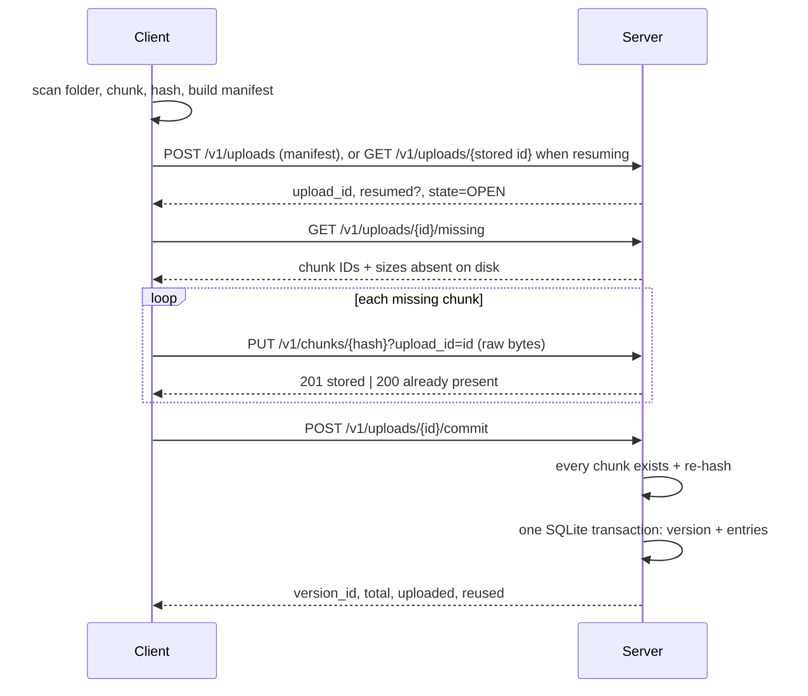

# BrokenVault architecture

A condensed design note. The full design is in [`LLD.md`](../LLD.md); requirements are in [`PRD_1.md`](../PRD_1.md).

## 1. Decisions

| # | Decision | Reason |
|---|---|---|
| D1 | Fixed-size chunks, 512 KiB by default, size recorded in the manifest | Simple and repeatable; inside the suggested 256 KiB to 1 MiB range |
| D2 | Chunk ID = SHA-256 of the original bytes; the server recomputes it before accepting | The server is the authority, never the client |
| D3 | A chunk "exists" when its file exists on disk | A deleted or altered chunk is always visible to `verify` and to later backups |
| D4 | SQLite (WAL, `synchronous=FULL`) for metadata | Atomic multi-row commit that survives a restart |
| D5 | `uploads` and `versions` are separate tables; a version row is written only inside the commit transaction | Unfinished work is structurally invisible to `list` and `restore` |
| D6 | Resume by upload ID: kept in SQLite by the server and in a state file by the client; `POST /uploads` with an identical manifest returns the open upload | The client returns to the same upload after any restart |
| D7 | Chunk write path: temp file, hash check, fsync, atomic rename | A partly written chunk is never readable as a chunk |
| D8 | Commit re-reads and re-hashes every distinct chunk the version needs, then inserts the version in one transaction | "Complete" means every chunk exists and passed a hash check, including chunks reused from older versions |
| D9 | Uploaded bytes come from an `upload_chunks` intent row inserted before the rename | Bytes are counted exactly once across crashes and resumes |
| D10 | HTTP/1.1, JSON control messages, raw chunk bodies | Easy to inspect with `curl`; no dependencies |

The server never deletes, overwrites or repairs a chunk file.

## 2. Components

```
Client (bv)                                   Server (bv-server)
  cli.py        argparse, exit codes            http_app.py        router + thin handlers
  scanner.py    walk, stat, build manifest      upload_service.py  create, missing, put_chunk, commit
  chunker.py    fixed-size streaming chunks     version_service.py list, manifest of a version
  backup.py     BackupRunner, state file        verify_service.py  damage scan + impact
  restore.py    Restorer, hash check            chunk_store.py     chunks/ab/<hash>, tmp/, atomic put
  transport.py  HTTP, retries, error mapping    db.py              SQLite schema, transactions
  output.py     human and JSON output           faults.py          test-only crash points
                         \                          /
                          common/: constants, hashing, paths, manifest, errors
```

Backup flow:



On disk:

```
<data-dir>/
  meta.db            SQLite (+ -wal, -shm)
  chunks/ab/ab12…    one file per distinct hash, raw bytes only
  tmp/<uuid>.part    in-flight writes, deleted at startup
```

## 3. Metadata schema

```sql
uploads(upload_id PK, manifest_id, manifest_json, state OPEN|COMMITTED|ABORTED,
        total_bytes, created_at, version_id)
  UNIQUE INDEX (manifest_id) WHERE state = 'OPEN'     -- one open upload per content
upload_chunks(upload_id, chunk_id, size, PK(upload_id, chunk_id))   -- newly accepted chunks
versions(version_id PK AUTOINCREMENT, upload_id UNIQUE, created_at, root_name, chunker_size,
         total_bytes, uploaded_bytes, reused_bytes, file_count, dir_count)  -- completed only
entries(version_id, path, type file|dir, size, mtime_ns, PK(version_id, path))
entry_chunks(version_id, path, idx, chunk_id, size, PK(version_id, path, idx))
  INDEX (chunk_id)                                   -- damage impact lookup
```

Version IDs are `V1`, `V2`, … assigned at commit, so an unfinished upload consumes none.

## 4. Upload service

- **create_upload**: validate the manifest (paths, sizes, chunk rules), compute `manifest_id` from the canonical JSON; return the existing `OPEN` upload for that ID or insert a new one.
- **missing**: for each distinct chunk of the manifest, list it when its file is absent. A present but damaged file is not listed and is never overwritten.
- **put_chunk**: check the chunk belongs to the upload and the length matches; if the file exists, reply `200 stored:false` and count nothing; otherwise stage to `tmp/` with a hash check and fsync, commit the `upload_chunks` intent row, then rename into place.
- **commit**: if already committed, return the same version (idempotent). Otherwise check every distinct chunk: absent gives `409 INCOMPLETE_UPLOAD` with the missing IDs; wrong size or hash gives `422 CORRUPT_CHUNK`. In both cases the upload stays `OPEN` and nothing is changed. When all pass, one `BEGIN IMMEDIATE` transaction inserts the version, its entries and chunk references, and marks the upload `COMMITTED`.
- `uploaded_bytes = SUM(upload_chunks.size)`; `reused_bytes = total_bytes − uploaded_bytes`.

Verify walks every distinct chunk referenced by `entry_chunks`, classifies it as `MISSING` or `CORRUPT` (size or hash), and uses the `chunk_id` index to list each version and file path that needs it. It writes nothing.

Restore validates the version's manifest again on the client, requires an empty or absent destination, resolves each path with `safe_join`, checks every chunk's size and hash as it is read, compares the final file size, then sets file mtimes and finally directory mtimes, deepest first.

## 5. Crash safety

| Crash point | Durable state afterwards | Result on retry |
|---|---|---|
| Client dies mid-upload | Stored chunks; upload `OPEN` | Same command resumes by upload ID; `missing` excludes stored chunks |
| Server dies while writing a chunk | Orphan `tmp/*.part`; no chunk file | tmp cleaned at startup; chunk is re-sent |
| Server dies after the hash check, before the intent row | Nothing durable | Re-sent, counted once |
| Server dies after the intent row, before the rename | Intent row, no chunk file | Listed missing, re-sent; the row already exists, so counted once |
| Server dies after the rename, before the response | Chunk file + intent row | Retry gets `200 stored:false`; not counted again |
| Server dies during commit re-hash | Nothing changed | Commit retried |
| Server dies inside the commit transaction | SQLite rolls back: no version rows | Upload still `OPEN`; commit retried |
| Server dies after commit, before the response | Version exists, upload `COMMITTED` | A retried commit returns the same version ID |
| Power loss | Chunk data fsynced before rename; DB `synchronous=FULL` | Same as above |

Four of these points can be forced in tests with the server variable `BV_FAULT` (`crash_after_chunks=N`, `crash_before_rename`, `crash_before_commit_tx`, `crash_after_commit_tx`); the client flag `--stop-after-chunks N` simulates an interrupt. Both are off by default.

## 6. HTTP handling

`ThreadingHTTPServer` with keep-alive. Chunk `PUT` needs `Content-Length` (411 otherwise) and at most 4 MiB (413 otherwise). When a handler fails before it has read the whole body, the server drains the rest (bounded by 4 MiB) or answers with `Connection: close`, so leftover bytes are never parsed as the next request. Errors are JSON: `{"error": {"code", "message", "details"}}`.
